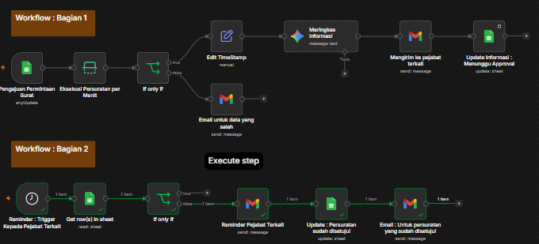
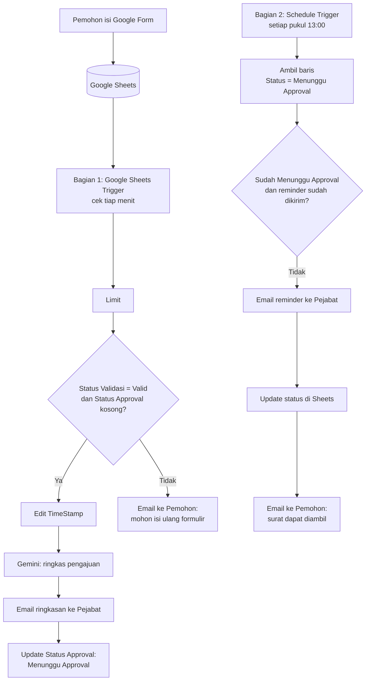

# Otomatisasi Pengajuan, Approval, dan Notifikasi Surat Kelurahan

## Preview Workflow dan Link n8n



**Link n8n** : https://primusfir.app.n8n.cloud/assistant/b634e4bd-2f6d-4c52-9376-37ee6a338416

**Final Project – AI Automation**
Dibuat oleh: **Muhammad Amar Primus Firdaus**

Workflow **n8n** yang mengotomatiskan proses persuratan di Kelurahan Jelambar: mulai dari pengajuan melalui Google Form, validasi data, ringkasan pengajuan oleh **AI (Gemini)**, permintaan approval ke pejabat, reminder, hingga notifikasi kepada pemohon bahwa surat dapat diambil.

---

## 1. Latar Belakang

Proses pengajuan surat di kelurahan melibatkan beberapa tahapan: pengisian data oleh pemohon, validasi oleh petugas, approval oleh pejabat, dan pemberitahuan hasil kepada pemohon. Jika dilakukan manual, proses ini memakan waktu lebih lama dan berisiko terjadi keterlambatan informasi kepada pihak terkait.

## 2. Tujuan & Alasan Automation

Automation dibuat untuk **mempercepat dan menyederhanakan** proses persuratan, khususnya pada:

- Pemantauan status pengajuan.
- Pemberian reminder kepada pejabat ketika pengajuan masih menunggu approval.
- Pengiriman notifikasi otomatis kepada pemohon (data perlu diperbaiki / surat siap diambil).
- Pengurangan pekerjaan manual dan risiko lupa memberi informasi.

## 3. Fitur Utama

| Fitur                      | Keterangan                                                                   |
| -------------------------- | ---------------------------------------------------------------------------- |
| Pengajuan via Google Form  | Pemohon mengisi data diri, jenis surat, dan keperluan.                       |
| Database di Google Sheets  | Seluruh respons tersimpan otomatis sebagai database pengajuan.               |
| Pengecekan status validasi | Conditional logic (IF) memisahkan data valid dan data yang perlu diperbaiki. |
| Ringkasan oleh AI          | Gemini membuat ringkasan singkat pengajuan untuk pejabat.                    |
| Email ke pejabat           | Pejabat menerima ringkasan pengajuan yang siap di-approval.                  |
| Reminder terjadwal         | Setiap hari pukul 13:00, pengajuan yang masih menunggu approval diingatkan.  |
| Notifikasi ke pemohon      | Email otomatis: permintaan isi ulang data, atau surat sudah dapat diambil.   |

## 4. Teknologi yang Digunakan

| Komponen                                         | Fungsi                                                      |
| ------------------------------------------------ | ----------------------------------------------------------- |
| **n8n**                                          | Platform workflow automation                                |
| **Google Forms**                                 | Formulir pengajuan surat                                    |
| **Google Sheets**                                | Database & pencatatan status (Validasi, Approval, Reminder) |
| **Gmail**                                        | Pengiriman email ke pemohon dan pejabat                     |
| **Google Gemini API** (`gemini-3-flash-preview`) | Model AI untuk meringkas pengajuan                          |

## 5. Arsitektur & Alur Kerja

Workflow terdiri dari **dua bagian** yang berjalan secara independen.



### Bagian 1 – Pengajuan, Validasi & Ringkasan AI

| No  | Node                                                     | Fungsi                                                                                                            |
| --- | -------------------------------------------------------- | ----------------------------------------------------------------------------------------------------------------- |
| 1   | **Pengajuan Permintaan Surat** (Google Sheets Trigger)   | Memantau spreadsheet setiap menit untuk data baru/berubah.                                                        |
| 2   | **Eksekusi Persuratan per Menit** (Limit)                | Membatasi pemrosesan agar dijalankan satu per satu.                                                               |
| 3   | **If only if** (IF)                                      | Lolos jika `Status Validasi = Valid` **dan** `Status Approval` masih kosong.                                      |
| 4   | **Edit TimeStamp** (Set)                                 | Merapikan field (nama, NIK, alamat, jenis surat, dll.) dan mengonversi timestamp ke format `dd/MM/yyyy HH:mm:ss`. |
| 5   | **Meringkas informasi** (Gemini)                         | Membuat ringkasan pengajuan untuk pejabat.                                                                        |
| 6   | **Mengirim ke pejabat terkait** (Gmail)                  | Mengirim ringkasan AI dan instruksi pengisian kolom _Status Approval_.                                            |
| 7   | **Update Informasi : Menunggu Approval** (Google Sheets) | Mengisi `Status Approval = Menunggu Approval` (pencocokan baris berdasarkan `Timestamp`).                         |
| 8   | **Email untuk data yang salah** (Gmail)                  | Cabang _false_: meminta pemohon mengisi ulang Google Form.                                                        |

### Bagian 2 – Reminder & Notifikasi Hasil

| No  | Node                                                      | Fungsi                                                                       |
| --- | --------------------------------------------------------- | ---------------------------------------------------------------------------- |
| 1   | **Reminder : Trigger Kepada Pejabat Terkait** (Schedule)  | Berjalan setiap hari pukul **13:00**.                                        |
| 2   | **Get row(s) in sheet** (Google Sheets)                   | Mengambil baris dengan `Status Approval = Menunggu Approval`.                |
| 3   | **If only If** (IF)                                       | Mengecek status dan penanda reminder (`Reminder`).                           |
| 4   | **Reminder Pejabat Terkait** (Gmail)                      | Mengirim reminder (nama pemohon, jenis surat, tanggal pengajuan) ke pejabat. |
| 5   | **Update : Persuratan sudah disetujui** (Google Sheets)   | Memperbarui kolom `Status Approval` dan `Reminder` berdasarkan `row_number`. |
| 6   | **Email : Untuk persuratan yang sudah disetujui** (Gmail) | Memberi tahu pemohon bahwa surat dapat diambil di Kantor Kelurahan Jelambar. |

## 6. Prompt AI

Prompt dirancang dengan struktur berikut agar output konsisten dan aman:

1. **Peran**: Asisten Administrasi Persuratan Kelurahan Jelambar.
2. **Tugas tunggal**: hanya membuat ringkasan pengajuan.
3. **Data input**: nama, NIK, alamat, jenis surat, keperluan, keterangan tambahan.
4. **Aturan wajib** (guardrails), antara lain:
   - Hanya memakai data yang diberikan, tidak mengarang informasi.
   - Tidak memberi keputusan/rekomendasi setuju atau tolak.
   - Tidak menulis salam pembuka/penutup maupun instruksi kepada pejabat.
   - Jika keperluan tidak jelas, tidak menebak maksud pemohon.
   - Jika keterangan tambahan kosong, tulis "Tidak ada".
5. **Format output tetap**:

```
Nama Pemohon: [nama]
Jenis Surat: [jenis surat]
Keperluan: [keperluan]
Ringkasan: [1–2 kalimat]
Catatan: [keterangan tambahan / informasi kurang jelas]
```

Keputusan approval **tetap sepenuhnya di tangan pejabat**; AI hanya membantu membaca data dengan lebih cepat.

## 7. Struktur Google Sheets

Sheet `Form Responses 1` berisi kolom:

| Kolom                                                                                                   | Diisi oleh                               |
| ------------------------------------------------------------------------------------------------------- | ---------------------------------------- |
| Timestamp, Nama Pemohon, NIK, Email, Alamat, Nomor Telepon, Jenis Surat, Keperluan, Keterangan Tambahan | Google Form (otomatis)                   |
| Status Validasi                                                                                         | Petugas (isi `Valid` jika data sesuai)   |
| Status Approval                                                                                         | Workflow (`Menunggu Approval`) / Pejabat |
| Reminder                                                                                                | Workflow                                 |

## 8. Langkah Instalasi & Konfigurasi

### Prasyarat

- Akun n8n (cloud atau self-hosted).
- Akun Google (Forms, Sheets, Gmail).
- API Key Google Gemini (dari Google AI Studio).

### Langkah-langkah

1. **Siapkan Google Form**
   Buat formulir dengan field: Nama Pemohon, NIK, Email, Alamat, Nomor Telepon, Jenis Surat, Keperluan, Keterangan Tambahan.
   Contoh formulir: https://forms.gle/RfmjN7EyU3DjFeXo6

2. **Hubungkan ke Google Sheets**
   Di tab _Responses_ → _Link to Sheets_. Lalu tambahkan tiga kolom manual di sebelah kanan: `Status Validasi`, `Status Approval`, `Reminder`.

3. **Import workflow ke n8n**
   Buka n8n → _Workflows_ → _Import from File_ → pilih file JSON workflow di repositori ini.

4. **Atur kredensial** (buat sendiri, jangan memakai kredensial orang lain):
   - Google Sheets OAuth2 (untuk node Sheets dan Sheets Trigger)
   - Gmail OAuth2
   - Google Gemini (PaLM) API

5. **Pilih ulang dokumen & sheet**
   Pada setiap node Google Sheets, pilih spreadsheet milik Anda dan sheet `Form Responses 1`.

6. **Ganti alamat email penerima**
   Pada node _Mengirim ke pejabat terkait_ dan _Reminder Pejabat Terkait_, isi dengan email pejabat yang sesungguhnya.

7. **Cek jadwal reminder**
   Pada node _Reminder : Trigger Kepada Pejabat Terkait_, sesuaikan jam jika perlu (default pukul 13:00).

8. **Aktifkan workflow**
   Klik _Publish/Active_ agar trigger berjalan otomatis.

## 9. Cara Menguji (Skenario Uji)

| Skenario           | Langkah                                                                                 | Hasil yang diharapkan                                                               |
| ------------------ | --------------------------------------------------------------------------------------- | ----------------------------------------------------------------------------------- |
| Data valid         | Isi form → petugas mengisi `Status Validasi = Valid`                                    | Pejabat menerima email ringkasan AI; `Status Approval` menjadi _Menunggu Approval_. |
| Data tidak valid   | Petugas mengisi status selain `Valid`                                                   | Pemohon menerima email permintaan isi ulang formulir.                               |
| Reminder           | Biarkan baris berstatus _Menunggu Approval_ hingga jam terjadwal (atau jalankan manual) | Pejabat menerima email reminder.                                                    |
| Notifikasi selesai | Alur reminder selesai dijalankan                                                        | Pemohon menerima email bahwa surat dapat diambil.                                   |

## 10. Keamanan & Privasi

- Data pemohon (NIK, alamat, telepon) bersifat **data pribadi**; batasi akses Google Sheets hanya untuk petugas terkait.
- Jangan mengunggah file JSON ke repositori publik tanpa memeriksa ID kredensial, ID spreadsheet, dan alamat email di dalamnya.
- Ringkasan AI hanya berisi data pengajuan dan tidak menggantikan keputusan pejabat.

## 11. Keterbatasan & Rencana Pengembangan

- Pengecekan status approval oleh pejabat (`Disetujui` / `Ditolak`) dapat ditambahkan sebagai kondisi IF sebelum email hasil dikirim ke pemohon.
- Menambahkan cabang email untuk pengajuan yang **ditolak** beserta alasannya.
- Menambahkan notifikasi lewat Telegram/WhatsApp.
- Menyeragamkan nilai status (mis. `Disetujui`) dan memperbaiki penulisan penanda reminder agar pencocokan kondisi lebih andal.
- Menambahkan penomoran surat otomatis dan pembuatan dokumen surat (PDF).

## Best Regards

**Muhammad Amar Primus Firdaus**
Final Project – AI Automation
